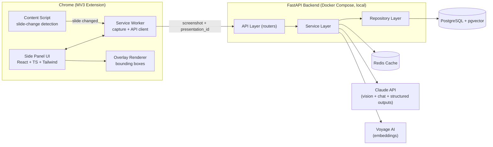

# VisionLearn AI — Architecture

Status: Draft v1 · Owner: Lead Architect · Companion docs: [DATA_MODEL.md](./DATA_MODEL.md) · [API_CONTRACT.md](./API_CONTRACT.md) · [PROMPTS.md](./PROMPTS.md) · [ROADMAP.md](./ROADMAP.md) · [adr/](./adr/)

## 1. Scope and Ground Rules

VisionLearn AI is a Chrome extension + local backend that turns STEM lecture slides into an interactive, queryable surface (text, equations, diagrams, charts). This document describes the target architecture for the MVP and the first several months of iteration.

Two decisions shape everything below and are recorded formally in the ADRs:

- **VLM-first AI pipeline** ([ADR-004](./adr/ADR-004-vlm-first-pipeline.md)): one multimodal Claude call per slide produces layout, OCR text, LaTeX, and figure analysis together, instead of chaining separate OCR / math-OCR / layout-detection / vision models. Every stage is still exposed behind a service interface, so a specialized engine (PaddleOCR, Pix2Text, a dedicated layout model) can replace or augment the VLM call later without touching callers.
- **Local-first deployment** ([ADR-007](./adr/ADR-007-local-first-deployment.md)): the target for the first few months is a single-user Docker Compose stack (FastAPI + PostgreSQL/pgvector + Redis) with no auth beyond a local API key. The data model is multi-tenant-ready (nullable `user_id` columns, see [DATA_MODEL.md](./DATA_MODEL.md)) so hosted multi-user mode is an additive change, not a rewrite.

## 2. System Overview



Request flow for a new slide: content script detects a slide change → service worker captures the visible tab → backend hashes the image → cache check (Redis) → on miss, `SlideAnalyzer` calls Claude with structured outputs → objects + embeddings persisted → sidebar renders objects as overlays and the "Ask" tab becomes slide-grounded. This is the same flow whether the presentation is a live deck in the browser or previously indexed.

## 3. Chrome Extension Architecture

Manifest V3. Three cooperating pieces, matching the Engineering Playbook's UI layout (slide never hidden; sidebar 350–420px, default 380px, collapsible/resizable, remembers width) and the Premium UI Guide's interaction model (hover → highlight, click → select, double-click → deep inspector, right-click → quick actions).

| Component | Responsibility |
|---|---|
| **Content script** | Detects slide changes on the host page (PDF viewer, Google Slides, PowerPoint Online, etc.) via `MutationObserver` on the slide container plus a periodic frame-diff fallback (perceptual hash of a downscaled canvas snapshot) for pages that don't expose clean DOM signals. Injects the bounding-box overlay layer (`ObjectOverlay`, `HoverOutline`, `SelectionBox`, `FloatingToolbar` per the UI guide's component list) positioned over the live slide, never over the extension UI. |
| **Service worker** | Owns `chrome.tabs.captureVisibleTab` (capture target: <150ms per the playbook's performance goals), the API client (fetch + SSE), and message routing between content script and side panel. Computes a client-side hash of the capture before sending, so identical slides shown twice in one session don't round-trip the image unnecessarily. |
| **Side panel UI** | React + TypeScript + Tailwind, rendered via the `chrome.sidePanel` API (not an injected iframe — see [ADR-008](./adr/ADR-008-chrome-side-panel.md)). Tabs: Ask, Concepts, Notes, Quiz, History, Settings (playbook navigation). Query modes: Figure / Slide / Presentation / General / Auto, selectable per question. |

**State and data flow.** The side panel never talks to the backend directly for slide capture — it asks the service worker, which owns the single source of truth for "what slide is currently active" and "what has already been analyzed this session," avoiding duplicate analyze calls when the panel re-renders.

**Offline / degraded behavior.** Per the Premium UI Guide's empty states (No lecture / No internet / No OCR / No results): the service worker detects backend unreachability and the side panel switches to an explicit offline state with a retry action, rather than silently failing requests.

## 4. Backend Architecture

A modular monolith, not microservices — explicit choice from both the PRD ("Claude Code Rules: keep services loosely coupled") and the Engineering Playbook ("Do not split into microservices until necessary"). See [ADR-005](./adr/ADR-005-modular-monolith.md).

```
backend/
  api/          # FastAPI routers — thin, no business logic
  services/     # One class per capability, defined against a Protocol
  repositories/ # DB access, one repository per aggregate
  models/       # Pydantic schemas (API) + ORM models (DB)
  db/           # Session management, migrations
  core/         # config, logging, cache client, prompt loader
```

### 4.1 Service layer

Every AI-facing capability is defined as a `Protocol` (structural interface) with one concrete implementation for the MVP. This is what makes the VLM-first decision safe to reverse later: callers depend on the protocol, not on "Claude."

| Service (protocol) | MVP implementation | Responsibility |
|---|---|---|
| `SlideAnalyzer` | `OpenAIVLMAnalyzer` (default) or `ClaudeVLMAnalyzer` | Given a slide image + presentation context, return typed `SlideObject[]` (layout, text, LaTeX, figure summaries) via one vision call with structured outputs. Two implementations exist behind the same protocol — see [ADR-009](./adr/ADR-009-openai-as-active-vlm-provider.md); which one `app/api/deps.py` selects is a billing/access decision, not an architectural one. |
| `EmbeddingService` | `VoyageEmbedder` (fallback: local `sentence-transformers`) | Turn object/slide text into vectors for `pgvector`. Anthropic has no embeddings endpoint, so this is a separate provider — see [ADR-006](./adr/ADR-006-embedding-provider.md). |
| `RetrievalService` | `PgVectorRetriever` | Vector + metadata search over `objects`/`slides` for a given presentation, scoped by query mode (Figure/Slide/Presentation). |
| `ChatService` | `ClaudeChatService` | Routes a user question to the right context window based on query mode, assembles the prompt (see [PROMPTS.md](./PROMPTS.md)), calls Claude with streaming + adaptive thinking, returns an SSE stream to the extension. |
| `QuizService` | `ClaudeQuizGenerator` | Generates quiz questions from indexed objects/concepts for a slide or presentation. |
| `NotesService` | `ClaudeNotesGenerator` | Generates structured notes/summaries per slide or presentation. |
| `CacheService` | `RedisCacheService` | Image-hash → analysis result cache; chat-response cache for repeated questions; TTL policy. |

Swapping `ClaudeVLMAnalyzer` for a specialized pipeline later (e.g. a real `OCRService` + `MathOCRService` + `LayoutService` composed inside a new `HybridAnalyzer`) requires no change to `api/` or to any other service — only a new class satisfying `SlideAnalyzer` and a config flag.

### 4.2 AI integration details

- **Model.** Both slide analysis and chat default to OpenAI (`OpenAIVLMAnalyzer` / `OpenAIChatService`, `gpt-4o`) as of [ADR-009](./adr/ADR-009-openai-as-active-vlm-provider.md) — the project owner's only currently-working paid key is OpenAI's, and that constraint applies equally to both AI-calling services (see ADR-009's Milestone 3 addendum, which extends the original analysis-only decision to chat). `claude-opus-4-8` (`ClaudeVLMAnalyzer` / `ClaudeChatService`) remains fully supported for anyone with Anthropic API access instead — see `app/api/deps.py` for the selection order, identical for both services. Model selection is a config table keyed by task (`analysis`, `chat`, `quiz`, `notes`), not hardcoded per call site, so cheaper models can be assigned per route without code changes.
- **Slide analysis call.** Vision content block (base64 image) + each provider's structured-outputs feature (Anthropic's `output_config.format`, OpenAI's `response_format` with `json_schema` + `strict`) constraining the response to an array of objects matching the `objects` table shape: `type` (title/paragraph/equation/diagram/graph/table/image), `bounding_box`, `extracted_text`, `latex`, `summary`, `confidence`. The schema and its parsing are defined once, shared by both analyzers (`backend/app/services/vlm_output.py`), so they can't silently drift apart in what shape of data they produce. Structured outputs guarantee parseable JSON in one round trip — this is the mechanism that collapses OCR + Math OCR + layout detection + figure classification into a single request.
- **Graph structure extraction.** For node/edge graph diagrams specifically, a hybrid pipeline replaces pure VLM interpretation: the VLM locates node and edge-weight-label positions (reliable), and `backend/app/services/graph_topology.py` — classical computer vision, not another model call — determines actual connectivity by pixel-sampling between candidate node pairs. See [ADR-010](./adr/ADR-010-hybrid-graph-structure-extraction.md) for the empirical measurements (pure VLM: ~69-75% edge accuracy on graphs with crossing lines, even with majority-voting across repeated calls; hybrid: 100% on the same test case) that motivated this split. Populates `SlideObject.graph_structure` (nullable — only set for diagrams the VLM identifies as node/edge graphs).
- **Chat call (Milestone 3).** Streaming, relayed to the extension as SSE (`POST /chat`, `backend/app/api/v1/chat.py`), `effort` tuned per query mode (`low` for Figure-scoped questions, `medium` for Slide-mode; `presentation`/`general`/`auto` are M4+ and rejected with 400 for now). `ChatService`'s two implementations (`OpenAIChatService`/`ClaudeChatService`) only own the provider call and streaming — context assembly (loading the right prompt file, formatting the figure/slide data as a delimited, clearly-not-instructions block) is the router's job, mirroring the split `vlm_output.py` draws for analysis. Anthropic's prompt-caching (`cache_control`) is deferred until Presentation-mode chat (M4) actually has a stable, reused context block worth caching — Figure/Slide-mode context is per-question, not reused across turns, so caching it wouldn't pay for itself yet.
- **Embeddings.** Voyage AI (`voyage-3` family) as the default embedding provider; a local `sentence-transformers` model is the offline/no-API-key fallback, selected via config. Both sit behind `EmbeddingService` so `RetrievalService` and the `embeddings` table are provider-agnostic (fixed vector dimension chosen at setup).
- **Cost controls.** (a) Redis + `cache_entries` keyed by slide image hash — an unchanged slide is never re-analyzed. (b) Prompt caching on the chat path. (c) Message Batches API as an option for bulk "index this whole deck up front" requests (50% cost, non-interactive), distinct from the interactive per-slide analyze path.

### 4.3 Query modes

`ChatService` resolves the active query mode into a retrieval + prompt strategy:

| Mode | Context assembled |
|---|---|
| Figure | The single selected object (bbox, extracted_text/latex, summary) + its slide's summary. |
| Slide | All objects on the current slide. |
| Presentation | Top-k retrieved objects/slides across the whole deck via `RetrievalService`, plus running conversation history. |
| General | No slide grounding — general AI assistance, still within the same conversation thread. |
| Auto | Backend heuristic (has a figure been selected? does the question reference "this slide" vs. "earlier" vs. nothing specific?) picks one of the above; falls back to Slide. |

## 5. Caching Strategy

Two independent cache layers, both required to hit the Engineering Playbook's performance goals (cached query <2s, fresh analysis <8s, capture <150ms):

1. **Analysis cache** (Redis, backed by `cache_entries` for durability): keyed by `sha256(image_bytes)`. A slide shown again — same deck, same viewer, or a different session — skips the Claude vision call entirely.
2. **Prompt cache** (Anthropic-side, via `cache_control` breakpoints): the stable per-presentation context block is cached so multi-turn chat and repeated Presentation-mode queries don't re-pay for the same context tokens.

Cache invalidation: analysis cache entries are content-addressed (image hash), so they never go stale — a changed slide simply hashes to a new key. Prompt cache entries expire per Anthropic's TTL (5m/1h) and are not manually invalidated.

## 6. Non-Functional Requirements

- **Logging.** Structured (JSON) logs including processing time, model used, cache hit/miss, object count, confidence — per the playbook's observability list. Slide content itself is never logged in production; only metadata.
- **Error handling.** The sidebar must never crash on a backend or model error. Every AI-service failure surfaces as a typed error result the UI renders as a friendly message with a retry action (per the UI guide's Error UX: what happened / why / what you can do), and falls back to "General" mode where relevant instead of a dead end.
- **Security.** Upload size limits on captured images; prompt-injection-aware system prompts (user-extracted slide text is *data*, not instructions — see [PROMPTS.md](./PROMPTS.md)); API keys live only in the backend's environment, never shipped to the extension; rate limiting is deferred to hosted mode ([ADR-007](./adr/ADR-007-local-first-deployment.md)) but the API contract already reserves the headers for it.
- **Testing.** Unit tests per service (mock the `SlideAnalyzer`/`EmbeddingService` protocols), API tests per router, integration tests for the capture → analyze → retrieve round trip. See [ROADMAP.md](./ROADMAP.md) for how this lands per milestone.

## 7. Future Architecture Notes

Per the playbook: keep services independent, don't split into microservices until there's a concrete scaling reason to. The most likely first candidate for extraction, if it ever happens, is the analysis pipeline (`SlideAnalyzer` + its cache), since it's the most compute- and cost-sensitive path — but this is explicitly deferred, not designed for now.
