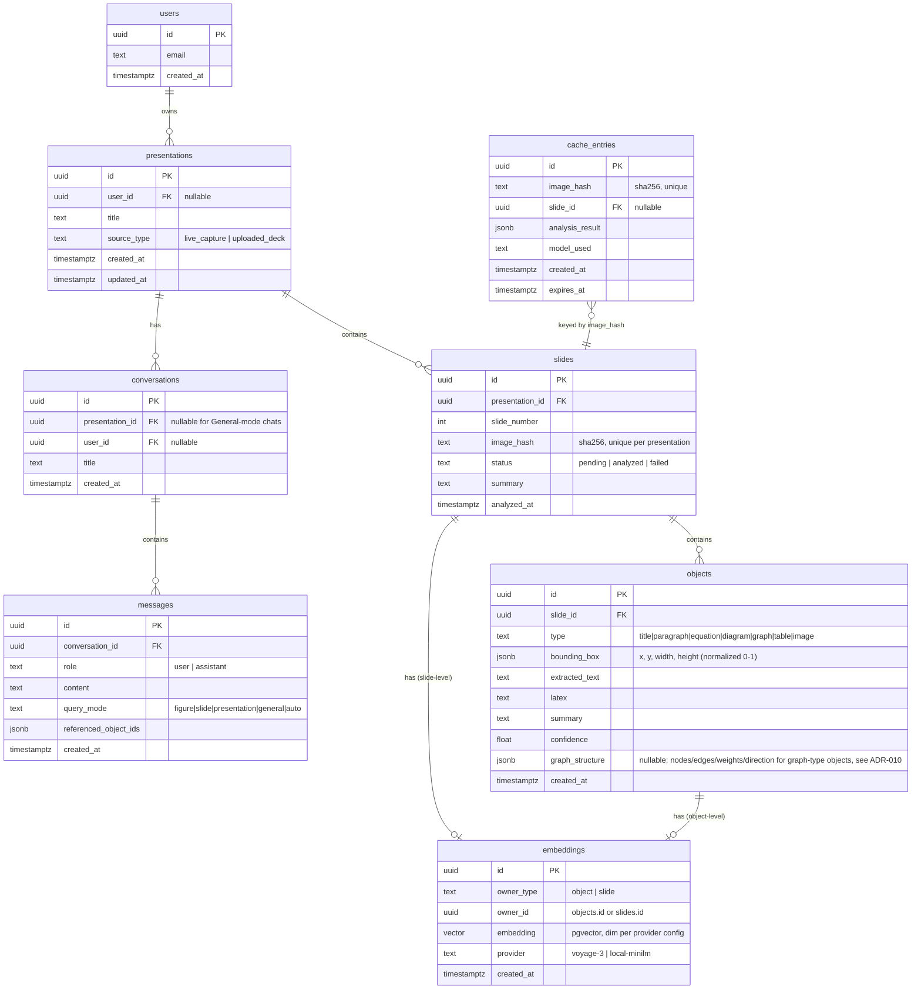

# VisionLearn AI — Data Model

Status: Draft v1 · Companion docs: [ARCHITECTURE.md](./ARCHITECTURE.md) · [API_CONTRACT.md](./API_CONTRACT.md)

PostgreSQL 15+ with the `pgvector` extension. Schema is described here for design review — actual migrations (Alembic) are an implementation task, not part of this doc.

## 1. Multi-tenancy stance

Per [ADR-007](./adr/ADR-007-local-first-deployment.md), the MVP runs single-user with no auth. Every table that will eventually need per-user scoping already carries a **nullable** `user_id UUID` column pointing at a `users` table that exists in the schema from day one but is unpopulated (a single implicit local user) until hosted mode ships. This avoids an `ALTER TABLE ADD COLUMN` + backfill migration later.

## 2. Entity-Relationship Diagram

## 3. Table Notes

### `users` (future-facing, unpopulated in MVP)
Exists so every FK below is stable across the local → hosted transition. In local-first mode, all rows implicitly belong to a single seeded user row (or `NULL`), and the API never requires an `Authorization` header.

### `presentations`
A logical deck — either a live capture session (slides accumulate as the user browses) or a batch-uploaded/indexed deck. `source_type` distinguishes them because it affects whether "Presentation mode" retrieval has a complete index to search yet.

### `slides`
One row per distinct slide seen. `image_hash` (see [ARCHITECTURE.md](./ARCHITECTURE.md) §5) is the cache key and the natural de-duplication key — re-showing the same slide in the same presentation resolves to the existing row rather than inserting a duplicate. `status` drives the sidebar's loading state.

### `objects`
The unit of retrieval and interaction (matches the MVP spec's `Object` data model exactly: id, slide_number — via `slide_id` join —, type, bounding_box, extracted_text, latex, summary, embedding — via the `embeddings` table —, confidence). `type` is constrained to the seven supported kinds from the spec. `bounding_box` is stored normalized (0–1 relative to slide dimensions) so it's resolution-independent when the overlay is rendered at any zoom level. `graph_structure` (Milestone 3 addendum, postdating this doc's original draft) isn't in the MVP spec's original `Object` model — added because `SlideObject` already carries it per [ADR-010](./adr/ADR-010-hybrid-graph-structure-extraction.md).

Implemented as of Milestone 3 (`backend/app/models/orm.py`'s `ObjectRecord`, `backend/app/repositories/objects.py`) — persisted once per `Slide` row, with **freshly minted ids**, not the ids `SlideObject` carried in the analyze response: the image-hash analysis cache (`cache_entries`) is global across presentations and round-trips the same cached ids for the same image, but this table's primary key must be unique across every slide, including a different presentation's slide for the identical image. See `ObjectRepository`'s docstring for the full reasoning — this table, not the cache, is the source of truth for "what object ids exist for this slide" once a `Slide` row exists.

### `embeddings`
Deliberately **not** a column on `objects`/`slides` directly — kept as its own table with a polymorphic `(owner_type, owner_id)` pair so:
- Both object-level embeddings (for Figure-mode retrieval) and slide-level summary embeddings (for Slide/Presentation-mode retrieval) live in one indexable structure.
- The embedding provider/dimension can change (`provider` column) without a schema migration on `objects`.

An HNSW index (`pgvector`'s `CREATE INDEX ... USING hnsw (embedding vector_cosine_ops)`) is the planned index type for approximate nearest-neighbor search at this scale.

### `conversations` / `messages`
Chat history, one conversation per (presentation, session) or standalone for General-mode. `messages.query_mode` and `referenced_object_ids` let the UI reconstruct "which objects were cited in this answer" for the Ask tab's citation display (per the Premium UI Guide's Chat UX: summary, explanation, related concepts, references, follow-up).

Implemented as of Milestone 3 (`backend/app/models/orm.py`, `backend/app/repositories/{conversations,messages}.py`) for Figure/Slide query modes only — every `conversations.presentation_id` created by `POST /chat` today is non-null (General-mode chat, the case this column is nullable for, isn't implemented yet).

### `cache_entries`
Durable backing store for the Redis analysis cache (§5 of ARCHITECTURE.md). Redis is the hot path; this table lets a cache entry survive a Redis restart and gives an audit trail of what was analyzed, with what model, and when. `expires_at` is advisory (cost/storage hygiene), not correctness-critical, since `image_hash` uniqueness is what actually prevents re-analysis.

## 4. Indexing Plan

| Table | Index | Purpose |
|---|---|---|
| `slides` | unique `(presentation_id, image_hash)` | De-duplication within a deck |
| `objects` | btree `(slide_id)` | Fetch all objects for a slide |
| `embeddings` | HNSW `(embedding)` partitioned by `owner_type` | Vector similarity search |
| `cache_entries` | unique `(image_hash)` | O(1) cache lookup |
| `messages` | btree `(conversation_id, created_at)` | Ordered history fetch |

## 5. Open Questions for Implementation

- Exact embedding dimension depends on the chosen Voyage model (`voyage-3` = 1024-dim) — fix this in the first migration and treat a provider change as requiring a re-embed, not a live dimension change.
- Whether `objects.bounding_box` needs a `page_rotation`/`scale` companion field for non-standard slide viewers is deferred until the extension's capture normalization is implemented (Milestone 1–2, see [ROADMAP.md](./ROADMAP.md)).
